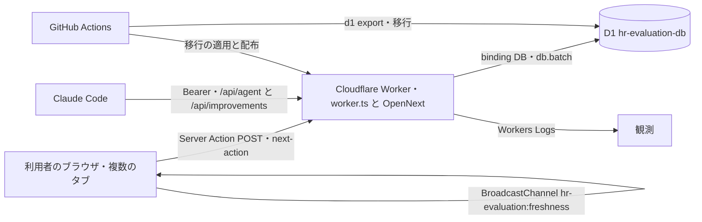

# アーキテクチャ: 保存した結果の鮮度

- feature: `feat-data-freshness`
- beads: 未採番

## Architecture overview

保存結果の鮮度と複数表への書き込みの整合を共通の入口で守る。英語見出しはテンプレート必須の要約・契約・判断一覧を持ち、具体的な処理は [層分け](#層分け)、理由は [設計判断](#設計判断)、配置は [主要ファイル](#主要ファイル)、試験は [テスト](#テスト) を正本とする。G・O・W・D などの記号の読み方は [仕様メモ「ID の読み方」](../specs/data-freshness.md#id-の読み方) にまとめた。

## Context and drivers

- Business/technical context: 会社・利用者・アンケートなどを作っても、再読み込みしてもしばらく出ない、という報告が全機能で起きていた。以前は34の画面がそれぞれ `router.refresh()` を呼ぶかどうかを決めており、呼び忘れと、呼ぶ前に止まる経路があった。応答の保存指示も経路ごとに揃っていなかった。アプリは Next.js 16.3.8（App Router）を OpenNext で Cloudflare Workers に載せ、データは D1 に置く。
- Quality attribute priorities: 1 位は鮮度と整合（U1・G1〜G5。成功と言った結果が必ず見え、書きかけが残らない）。2 位はセキュリティ（別のサイトからの書き込みを断る・初期パスワードの控えを平文で残さない）。3 位は往復の少なさ（成功の表示と新しい画面を1往復で届ける）。4 位は運用費用（常時接続を持たない）。配布の速さはこれらより後に置く。
- Constraints: Workers の実行ファイルは圧縮後 3,072 KiB まで（`check:bundle-size`）。D1 の batch は1つのトランザクションだが、1回に入る量には限りがある。サーバーアクションの本文は 8 MB まで（`serverActions.bodySizeLimit`）。Claude Code 向けの口・書き出し・認証の口は画面の外から呼ばれるので、Route Handler のまま形を変えない。

## Goals and non-goals

- Goals: G1 成功を表示した時点で、同じタブの一覧・件数・会社切替がその結果を含む。G2 通常・強制の再読み込みと URL の直接表示が直前の結果を含む。G3 同じ利用者の他のタブと、スマホ・タブレットの画面復帰で古い一覧のまま操作を続けない。G4 画面や書き込みを足しても、鮮度の保証が共通の入口で効き、適用漏れは試験で落ちる。G5 複数の表を書く保存が途中で失敗しても中途の状態を残さず、取り消しまで失敗したら記録に残す。
- Non-goals: 別の利用者・別の端末の画面への押し出し（常時接続。W1）。応答を待たずに一覧へ足す楽観更新（UX-030）。仮パスワードそのものの失効（W4 / SECURITY-005）。配布の自動ロールバック。

## System context and boundaries

- Users/external systems: 4つの役割（SUPER_ADMIN・COMPANY_ADMIN・MANAGER・EMPLOYEE）の利用者が、PC・スマホ・タブレットのブラウザから使う。画面の外の相手は、Claude Code（端末の承認で得た Bearer の鍵で `agent/device`・`agent/token`・`improvements` を呼ぶ）、認証ライブラリ Better Auth の口（`auth/[...all]`）、配布を行う GitHub Actions。
- Trust/deployment/data boundaries: ブラウザと Worker の間は同じ送信元に限る（Next.js の送信元検査と `assertSameOrigin` の二重）。Worker と D1 の間は binding `DB` だけ。秘密の値（`BETTER_AUTH_SECRET`・`AGENT_API_KEY`・`CREDENTIAL_ENC_KEY`）は Workers の secret に置き、リポジトリには置かない。会社の境界は `company_id` で、他社の行は 404 で返す。他のタブへの知らせは同じブラウザの同じ origin の中だけに届く。
- Context diagram:



## Container and component view

画面・入口・サーバーアクション・書き込み・D1 の責務とインターフェースは [層分け](#層分け)、配置は [主要ファイル](#主要ファイル) を参照。画面は一時的な状態だけを持ち、各資源の表は D1 が持つ。ブラウザの JS は Worker が配り、サーバー側の部品は Worker に配置する。公開する入口の本数は [Domain and module boundaries](#domain-and-module-boundaries) に記載する。

## Cross-cutting contracts

- Identity/access: ログインは Better Auth のセッション（Cookie）。入口の `apiViewer` がセッションと役割を確かめ、役割は `atLeast` で判定する（上位の役割は下位の入口も使える）。Bearer の鍵は Claude Code 向けの口だけで受け付ける。
- Errors/resilience: サーバーアクションの成功は `{ ok: true, message, ...data }`、失敗は HTTP 200 の `{ ok: false, message }` に畳む。Route Handler は状態コード（400・401・403・404・409・410・413・429）と `{ ok: false, message }` を返す。想定外の失敗は中身を伏せて決まった文面で返す。自動のやり直しはしない（`rollForward` の1回だけが例外）。
- Observability/audit: Workers Logs（`observability` 有効）に `compensation_failed`・`rollforward_failed`・`credential_memo_revealed` を残す。応答には `x-generated-at` を付ける。制度マスタの変更は `constitution_events` に本体と同じ batch で残す。画面の保存は `/api/usage` へ `/actions/{resource}` の形で記録する。
- Configuration/secrets: 設定は `wrangler.jsonc`（`compatibility_date` 2026-08-08、D1 binding `DB`）と `next.config.ts`（`serverActions.bodySizeLimit` 8 MB。`allowedOrigins` は足さない）。秘密の値は Workers の secret。ローカルの `.dev.vars` はコミットしない。
- Compatibility/versioning: 退避した Route Handler 22本は 404 を返す（廃止）。残した9系統の形は変えない。移行は前へ進める形だけ（0031・0032）。

## Subtype architecture

合成の対象は5種で、どれも該当する。各節は下の H3 にある。

- Frontend: Frontend architecture（画面側の呼び出し・タブ間の知らせ・描き終わりの待ち合わせ）
- Backend: Backend architecture（共通の入口・サーバーアクション・書き込みの型）
- Infrastructure: Infrastructure architecture（Workers・D1・配布の流れ）
- Data: Data architecture（監査記録の番号の一意・控えの表）
- Security: Security architecture（送信元の二重検査・控えの暗号化・役割と会社の境界）

### Frontend architecture

#### Rendering and application pattern

- Pattern: App Router のサーバー描画。ログイン後の画面は動的描画で、毎回 D1 から読む。入力と操作は Client Component。
- Framework/runtime and selection rationale: Next.js 16.3.8・React 19.2 を OpenNext（`@opennextjs/cloudflare`）で Workers に載せる。サーバーアクションの応答に新しい画面を同梱できる（`next/cache` の `refresh()`）ので、鮮度を構造で守れる（D-002）。
- Browser/device support: PC・スマホ・タブレットのブラウザ（spec-state の6つの platform）。画面の通し試験は Desktop Chrome で回し、同じタブと控えは 375px・768px の幅でも確かめる。

#### Routes, screens and navigation

- Route/screen map: 全44画面の正本は `system-spec/route-ledger.json`。`page.tsx` との一致を `pnpm run check:docs` が確かめる。
- Authentication guard/deep link/history: ログインが要る画面はセッションが無ければ `/login` へ送る。URL の直接表示は動的描画なので最新を返す（G2）。戻るボタンで bfcache から戻ったとき（`pageshow` の `persisted`）は、ルーターが画面を戻し終えた後に取り直す。

#### Component and design-system boundaries

- Component hierarchy: [層分け](#層分け) の共通呼び出しと見張りを使う。成功の知らせと控えの配置・開閉条件は [設計判断](#設計判断) 11。
- Design tokens/reusable primitives: 色はテーマ契約（`docs/product/spec.md`「テーマ契約（全画面共通）」、`src/app/globals.css`）の値だけを使う。この機能で新しい色は足していない。
- Accessibility standard: 全系統・明暗ともに WCAG AA（本文 4.5:1・境界線 3:1）を満たす（`spec.md`）。成功・失敗は色だけでなく文字で伝える。

#### State and data flow

- Local/server/global state ownership: 一覧・件数・会社切替はサーバーが描いた画面が正本で、ブラウザ側に一覧の写しを持たない。部品が持つのは送信中・結果の文面など一時的な状態だけ。
- Fetch/cache/invalidation/optimistic update: [層分け](#層分け) の応答とタブ間通知に従う。楽観更新はしない（UX-030）。
- Form/validation/error presentation: 入力の形はサーバーの zod で確かめ、失敗は `message` として部品が出す。通信の失敗は「送れませんでした。通信を確かめて、もう一度押してください。」、古い画面からの送信は「画面が古くなっています。再読み込みしてから送ってください。」。

#### Backend integration

- API client/generated types/versioning: 生成した API クライアントは持たない。画面は `src/actions` の関数を TypeScript で直接呼ぶので、型はそのまま共有される。部品に書き込みの `fetch` を作らない（`server-actions-contract.test.ts`）。
- Auth/session/CSRF/CORS: セッションは Cookie。別のサイトからの送信は Next.js の送信元検査と `assertSameOrigin` の二重で断る。CORS は開けない。
- Offline/retry/timeout: 通信が戻ったとき（`online`）に取り直す。自動で送り直さず、文面で押し直しを頼む。

#### Performance and observability

- Bundle/render/Core Web Vitals budgets: Worker の実行ファイルは圧縮後 3,072 KiB まで。取り直しは 1.5 秒に1回へ間引く（O3 の1秒との関係は [製品仕様 §27-3](../docs/product/spec.md)）。保存は1往復で表示まで届く。この機能では Core Web Vitals の数値目標を新たに置かず、往復の回数を構造で抑える。
- Client logs/metrics/traces and privacy: 保存ごとに `/api/usage` へ `/actions/{resource}` を `sendBeacon`（使えなければ `keepalive` の fetch）で送る。`x-generated-at` は時刻だけで、利用者や会社を表す値を載せない。

#### Frontend verification

- Unit/component/visual/e2e/accessibility: 下の「テスト」のうち `use-refresh`・`freshness`・`RecordForm` の単体試験と、画面の通し試験 `e2e/data-freshness.spec.ts`・`e2e/data-freshness-component-types.spec.ts`（経路の一覧は前者の冒頭の注釈が正本）。配色の AA はテーマの契約試験が確かめる。

### Backend architecture

#### Runtime and architecture pattern

- Runtime/framework/version: Cloudflare Workers（`compatibility_date` 2026-08-08）、Next.js 16.3.8 のサーバーアクション、Drizzle ORM 0.45、zod 4、Better Auth 1.6。
- Pattern: [層分け](#層分け) に従い、描き直しは共通の入口だけが呼ぶ。
- Selection rationale and rejected alternatives: D-002 で `opt-server-functions` を選んだ（退けた案は「Architecture decisions」の D-002、理由は「設計判断」1・2）。`revalidatePath`・`revalidateTag`・`unstable_cache` は使わない（サーバー側にデータのキャッシュを持たないので消す対象が無い）。

#### Domain and module boundaries

- Bounded contexts/modules: `src/actions` を資源ごとに分ける。資源の一覧は [層分け](#層分け)、配置は [主要ファイル](#主要ファイル)。
- Dependency direction: 画面は `src/actions` の関数だけを呼ぶ。サーバーアクションは入口を通り、`src/lib` の書き込みの型と `src/db` を使う。書き込みの型は画面を知らない。
- Public/internal interfaces: 公開するのはサーバーアクション41本（`runAction` 37・`runRead` 4）と Route Handler 9系統。書き込みの型と控えの関数は内部だけで使う。

#### API and service contracts

- Protocol/style/versioning: 画面からはサーバーアクション（ページのパスへの POST、`next-action` ヘッダー）。画面の外からは Route Handler（JSON。Claude Code 向けの断りはテキスト）。版の接頭辞は持たず、退避した22本は 404 で返す。
- Request lifecycle: [層分け](#層分け) の入口の順序に従い、成功した保存だけ描き直す。`runRead` は描き直さない。
- Error taxonomy: 400 入力の誤り・所属会社なし、401 未ログイン・鍵の失効、403 役割が足りない、404 対象なし・他社の行、409 同時保存、410 控えの期限切れ、413 大きすぎる、429 回数の上限、500 想定外（決まった文面）。

#### Data and transaction behavior

- Repository/data owner: 表は Drizzle のスキーマ（`src/db`）が持ち、書き込みは各サーバーアクションが自分の資源の表に対して行う。
- Transaction/idempotency/concurrency: 書き込みは3つの型に限り、引き換えは一度だけ通し、同時保存は 409 で断る。型・失敗時の保証は [設計判断](#設計判断) 5・6、検証は [テスト](#テスト)。
- Cache consistency/invalidation: サーバー側にデータのキャッシュを持たない。ログイン後の画面は `private, no-cache, no-store`、`/api/*` は `private, no-store`。成功したら同じ応答で画面を作り直す。

#### Async processing

- Queue/event/scheduler: キューと定期実行は持たない。`refresh()` は `run()` の成功時処理（`onSuccess`）で応答を返す前に呼び、応答の後へ回す処理（`next/server` の `after()`）は使わない。期限切れの控えの掃除は、次の発行の batch の先頭で行う。他のタブへの知らせはブラウザの `BroadcastChannel` で、サーバーを通らない。
- Delivery/order/dedup/retry/DLQ: 他のタブへの知らせは届かなくてもよい作りで、画面復帰と通信復帰の取り直しが受け皿になる。やり直しは `rollForward` の1回だけで、2回目の失敗は `rollforward_failed` として残す。DLQ は持たない。

#### Security and resilience

- Authn/authz/input validation: 入口でセッション・役割・会社の境界を確かめてから本体を動かす。入力は zod、大きさは入口ごとの上限（agent-keys 4,000、improvements 960,000・16,000・4,000、CSV 6,100,000 バイト）。
- Timeout/retry/circuit breaker/load shedding: 回数の上限で負荷を断る（パスワード変更 10 秒に3回、改善要望 60 秒に5回、利用状況 60 秒に20回、Claude Code 向け 60 秒に30回）。自動のやり直しとサーキットブレーカーは持たない。

#### Operations and verification

- Logs/metrics/traces/health/readiness: Workers Logs の記録（`compensation_failed`・`rollforward_failed`・`credential_memo_revealed`）、応答の `x-generated-at`、配布後のスモーク試験（`/` と `/login`）。
- Unit/contract/integration/load/failure tests: 契約・単体・結合の試験は下の「テスト」が正本。負荷試験は回していない（常時接続を持たず、1保存1往復の作りのため）。

### Infrastructure architecture

#### Environments and topology

- Local/test/staging/production parity: ローカル（`pnpm dev` と、build を挟んだ `preview`。D1 はローカルの複製）、CI（GitHub Actions `ci.yml`）、本番（Cloudflare Workers と D1 `hr-evaluation-db`）。ステージング環境は持たず、本番と同じ OpenNext の build を `preview` で動かして確かめる。
- Regions/zones/network/trust boundaries: Worker は Cloudflare のエッジで動き、D1 は1つのデータベースを binding `DB` で使う。静的アセットは binding `ASSETS`。
- DNS/TLS/edge/ingress/egress: TLS とエッジは Cloudflare が受け持つ。ゾーンに HTML・`/api` を保存するキャッシュ規則を置かない（本番での確認は W2）。Worker から外部への通信はこの機能には無い。

#### Compute and storage

- Runtime/compute/scaling: Workers（`main` は `worker.ts`）。実行ファイルは圧縮後 3,072 KiB まで、サーバーアクションの本文は 8 MB まで。
- Database/object/cache/queue: D1 だけを使う。KV・R2・Queues・Durable Objects はこの機能では使わない。
- Capacity and cost budgets: 常時接続（Durable Objects と WebSocket）を持たないので、接続の数に比例する費用が出ない（D-001 で `opt-push` を退けた理由の1つ）。

#### IaC and delivery

- IaC tool/state/locking: 設定は `wrangler.jsonc`、移行は `drizzle/migrations` をリポジトリで管理する。D1 の操作と配布は同じ concurrency group（`production-d1-and-deploy`）で直列にする。
- CI/CD stages, approvals, provenance: `main` への push（または手動実行）で、`check:docs` → `cf-typegen` → `typecheck` → `test:coverage` → `cf:dry-run` → `check:bundle-size` → D1 のバックアップ → 移行の適用 → 配布 → スモーク試験（30 秒後と、さらに 90 秒後）。変更はプルリクエストで確かめてから `main` に入れる。
- Immutable artifacts/config promotion: 配布物はその commit から workflow の中で作る。設定は同じ `wrangler.jsonc` を使う。

#### Secrets and access

- Secret authority/rotation/injection: Workers の secret（`BETTER_AUTH_SECRET`・`AGENT_API_KEY`・`CREDENTIAL_ENC_KEY`）と、GitHub Actions の secret（`CLOUDFLARE_API_TOKEN`・`CLOUDFLARE_ACCOUNT_ID`）。`CREDENTIAL_ENC_KEY` は32バイト（`openssl rand -base64 32`）で、鍵の版（鍵の SHA-256 の先頭6バイト）を控えに記録する。鍵を替えると前の鍵の控えは開けなくなり、再発行を頼む。
- Human/service access and least privilege: workflow の権限は `contents: read`。本番 DB を変える手動実行（`migrate.yml`）は対象環境の選択と `APPLY` の入力を求める。

#### Reliability and recovery

- SLO/alerts/on-call: この機能では SLO と当番を新たに置かない。配布後のスモーク試験と Workers Logs の記録で異常に気づく。
- Backup/restore/RPO/RTO/DR: 移行の前に `wrangler d1 export` で全体を書き出し、Artifact に14日保管する。RPO・RTO の数値目標は置いていない。DB を戻すときは、保管したバックアップと移行の互換性を確かめる（`docs/deploy-notes.md` §8）。
- Failure domains/failover: 自動のロールバックはしない。移行の後に配布だけが失敗したら同じ workflow を再実行する。古い isolate・認証・設定の不備を切り分けてから `wrangler rollback` を選ぶ。

#### Infrastructure verification

- Plan/policy/security/drift/smoke/restore tests: `cf:dry-run`（build が通る）、`check:bundle-size`（容量）、`wrangler d1 migrations list`（未適用0件）、スモーク試験（`/` は 200 か 30x、`/login` は 200）、`check:docs`（文書とルートのずれ）。

### Data architecture

#### Data domains and ownership

- System of record/data owner: D1 が唯一の正本。会社・利用者・社員・制度マスタ・評価・アンケート・改善要望・利用状況の表は、それぞれのサーバーアクションが書く。
- Classification/residency/tenant boundary: 社員の氏名と評価は会社ごとのデータで、`company_id` で分ける。他社の行は 404 で返す。初期パスワードの控えは秘密の値として暗号化する。

#### Logical and physical model

- Entities/relations/invariants: 監査記録の番号は実体ごとに一意。控えは利用者1人に1つ（再発行で置き換わる）。会社には必ず管理者がいる（会社の追加は会社 → 制度 → 管理者の順に書き、途中で失敗したら逆順に消す）。
- Tables/collections/fields/types/nullability: `initial_credential_memos`（0031）は `user_id`（text・主キー・`users` を参照し、消すと cascade）、`ciphertext`・`iv`・`key_version`（text・必須）、`issued_by`（text・空を許す）、`issued_at`（integer・必須）。
- Keys/constraints/indexes/partitioning: `uq_ce_entity_seq`（`company_id`・`entity_type`・`entity_id`・`seq`）を一意の索引にし、0032 で `idx_ce_entity` を外した。分割は持たない。

#### Access and consistency

- Read/write paths and query patterns: 書き込みはサーバーアクションの batch。読み出しは動的描画の中で毎回 D1 から読む。検索は語が空なら0件、結果は8件まで。
- Transaction/isolation/consistency: D1 の batch は1つのトランザクション。同じ項目の同時保存は一意の索引で後のほうが丸ごと失敗し、409 で返す（自動でやり直さない）。
- Cache/search/analytics derivation: データの写し・キャッシュは持たない。利用状況は `/api/usage` が記録と古い記録の掃除を同じ batch で行う。

#### Lifecycle and governance

- Creation/update/deletion/retention: 控えは発行から14日（`MEMO_TTL_DAYS`）で開けなくなり、次の発行の batch で消える。本人がパスワードを変えると消え、再発行すると置き換わる。利用者を消すと控えも消える（cascade）。
- PII/encryption/masking/audit: 控えは AES-GCM で暗号化し、利用者IDを付加データにする。応答に仮パスワードの値を返さない（控えを開く `runRead` だけが画面の中に出す）。控えを開くたびに `credential_memo_revealed`（操作した人・対象・会社）を残す。
- Schema ownership/catalog/lineage: スキーマは `src/db` の Drizzle の定義、移行は `drizzle/migrations`。制度マスタの変更の履歴は `constitution_events`。

#### Migration and recovery

- Versioning/backfill/online migration: 0031 で控えの表を足す。0032 は同じ実体の中で（`seq`・`occurred_at`・`id`）の順に番号を振り直してから一意の索引を張る。移行は配布の前に同じ workflow で適用する。
- Backup/restore/integrity reconciliation: 移行の前の `wrangler d1 export`（Artifact に14日）。戻すときは移行との互換性を確かめる。パスワード変更の続きが失敗したときは、本人がもう一度パスワードを変えれば揃う（本番 DB を手で書き換えない）。

#### Data verification

- Constraint/migration/query-plan/load/privacy tests: 下の「テスト」のうち、監査記録の番号と同時保存・控え・会社の追加の行。

### Security architecture

#### Assets, actors and threat model

- Protected assets/data classification: 初期パスワードの控え、ログインのセッション、社員の氏名と評価、Claude Code の Bearer の鍵、秘密の値（`CREDENTIAL_ENC_KEY` など）。
- Actors/adversaries/abuse cases: 4つの役割の利用者、他社の管理者（会社の境界を越える読み書き）、別のサイト（Cookie 付きのサーバーアクションの送信）、鍵を持つ Claude Code、鍵や控えが漏れた場合の第三者。
- Trust boundaries/data flows: ブラウザと Worker（同じ送信元に限る）、Worker と D1（binding だけ）、Worker と秘密の値（Workers の secret）。配布は GitHub Actions からだけ。

#### Identity and authorization

- Authentication/session/federation: Better Auth のセッション（Cookie）。本人のパスワード変更では、この端末のログインを保ち、他の端末のログインを切る。Claude Code は端末の承認（SUPER_ADMIN が確認コードを調べて承認する）で鍵を得る。
- Authorization model and deny-by-default rules: 入口の `apiViewer` がセッションの無い呼び出しと役割の足りない呼び出しを、本体より前に断る（1行も書かない）。会社の変更・切替と利用者の追加・変更は SUPER_ADMIN だけ。
- Tenant/resource ownership enforcement: 会社の範囲は `company_id` で絞り、他社の行は 404。控えを開けるのは SUPER_ADMIN と同じ会社の管理者だけ。本人の登録内容は本人の行だけを、会社が開放した項目だけ変えられる。

#### Data and secret protection

- Encryption in transit/at rest/key ownership: 通信は Cloudflare の TLS。控えは AES-GCM（12バイトの iv、利用者IDを付加データ）で暗号化し、鍵は `CREDENTIAL_ENC_KEY`。鍵が無い場合の発行方針は [設計判断](#設計判断) 7。
- Secret source/rotation/redaction: 秘密の値は Workers の secret とローカルの `.dev.vars`（コミットしない）。鍵を替えると鍵の版が変わり、前の控えは開けず再発行になる。応答・記録に仮パスワードの値を載せない。
- Retention/deletion/privacy requests: 控えの期限・削除は [設計判断](#設計判断) 12、応答の保存指示は [層分け](#層分け)。

#### Application and supply-chain controls

- Input/output validation and injection defenses: すべての入口で zod と大きさの上限を通す。SQL は Drizzle ORM の組み立てで、文字列をつないで作らない。想定外の失敗は決まった文面にする。
- Dependency/artifact provenance/signing/SBOM: 依存は `pnpm-lock.yaml` で固定し、更新はプルリクエストで試験を通してから入れる（直近では Next.js 16.3.3 と Vitest 4.1.11 への更新）。署名と SBOM は作っていない。
- CI/CD branch/review/environment protections: 配布は `main` への push と手動実行だけ。D1 の操作と配布は直列。本番 DB を変える手動実行は `APPLY` の入力を求める。

#### Detection and response

- Audit events/security telemetry/alerts: `credential_memo_revealed`・`compensation_failed`・`rollforward_failed` を Workers Logs に残す。回数の上限を超えた呼び出しは 429。
- Incident response/revocation/recovery: Claude Code の鍵は管理画面から失効できる。控えが疑わしいときは再発行で置き換える。手順は `docs/deploy-notes.md` §6〜§8。
- Vulnerability handling and SLA: 見つけた弱点は backlog の SECURITY 番号で扱う（SECURITY-001 はこの作業で閉じた。SECURITY-005 は W4 として残る）。対応の期限の数値は置いていない。

#### Security verification

- SAST/SCA/secret scan/authz/abuse/penetration tests: 送信元・認可・控え・端末の引き換えの試験は下の「テスト」が正本。Claude Code の鍵の発行と失効は `src/actions/agent-keys.integration.test.ts`。SAST・SCA の専用の道具と侵入試験は回していない。

## Architecture decisions

| ADR | Decision | Alternatives | Trade-on rationale | Consequences |
|---|---|---|---|---|
| D-001 | `opt-broadcast`: `BroadcastChannel` で同じブラウザの他のタブへ知らせ、`visibilitychange`・`pageshow`（`persisted`）・`online` でも取り直す | `opt-polling`（一定の間隔で取り直す）、`opt-push`（Durable Objects と WebSocket で配信） | 「設計判断」3 | 良い点: 費用ゼロ・送ったタブで二重に描き直さない。悪い点: 別の利用者・別の端末の画面は、戻るか開き直すまで古い（W1） |
| D-002 | `opt-server-functions`: 書き込みをサーバーアクションへ移し、成功したら同じ応答で画面を作り直す（`refresh()`） | `opt-route-refresh`（Route Handler のまま、画面の共通口が成功後に `router.refresh`） | 「設計判断」1・2 | 良い点: G1・G4 を構造で守る。悪い点: 画面から使っていた Route Handler 22本を退避した（今は 404） |
| D-003 | `opt-batch-first`: batch に入るものは batch、入りきらない会社の追加は補償、戻せない書き込みの続きはやり直し | `opt-d1-batch`（すべて batch 一回）、`opt-compensation`（順に書いて失敗したら消す） | 「設計判断」5 | 良い点: 書きかけを残さない。悪い点: 型が3つになり、3つの外を作らないことを `write-atomicity-contract.test.ts` とレビューで守る |
| ADR-004 | 保存させない指示を API の出口（`handle`・`jsonError`）でまとめて付ける | Route Handler ごとに付ける | 「設計判断」4 | 失敗に添えた待ち時間などのヘッダーは残し、保存の指示だけを固定する |
| ADR-005 | 成功の結果は新しい画面が描き終わってから返す（`createCommitGate`） | 応答を受けたらすぐ返す | 「設計判断」8 | 部品ごと消えたときも後片付けで関所を開け、呼び出し元を待たせない |
| ADR-006 | 初期パスワードの控えを暗号化して残し、14日で開けなくする | 控えを残さない、平文で残す | 「設計判断」7 | 鍵が無い環境では控えを作らず、発行は止めない（W3） |
| ADR-007 | 別のサイトからの書き込みを Next.js の検査と `assertSameOrigin` の二重で断る | どちらか一方だけ | 「設計判断」13 | `allowedOrigins` を足さないことが前提になる |
| ADR-008 | 同じ項目の同時保存は 409 で断り、自動でやり直さない | 自動でやり直す、後勝ちで上書きする | 「設計判断」6 | 利用者に再読み込みを頼む文面が出る |

## Delivery, migration and rollback

- Build/deploy topology: `main` への push で `deploy.yml` が動く。試験と build（`check:docs`・`cf-typegen`・`typecheck`・`test:coverage`・`cf:dry-run`・`check:bundle-size`）→ D1 のバックアップ（Artifact に14日）→ 移行の適用 → `deploy:worker` → スモーク試験の順。D1 の操作と配布は同じ concurrency group で直列。
- Migration sequence: 0031（控えの表）→ 0032（監査記録の番号の振り直しと一意の索引）。どちらも前へ進める形で、配布の前に適用する。適用済みの移行は再適用されない。
- Rollback trigger/procedure: 自動のロールバックはしない。スモーク試験の失敗や、Workers Logs の `compensation_failed`・`rollforward_failed` がきっかけ。移行の後に配布だけが失敗したら同じ workflow を再実行する（未適用0件を確かめてから配布を再開する）。古い isolate・認証・設定の不備を切り分けてから `wrangler rollback` を選ぶ。DB を戻すときは、保管したバックアップと移行の互換性を確かめる（`docs/deploy-notes.md` §8）。

## Risks and verification

- Risk/assumption: (1) 関数をまたいで2つの表を書く形は静的な検査では見えない（レビューで確かめる）。(2) bfcache から戻ったときの取り直しの順序は Next.js のルーターの振る舞いに依存する。(3) 本番の `CREDENTIAL_ENC_KEY` が未設定だと控えが作られない（W3）。(4) ゾーンのキャッシュ規則が HTML や `/api` を保存すると G2 が崩れる（W2）。(5) 別の利用者・別の端末への押し出しは持たない前提（W1）。
- Architecture fitness test: [テスト](#テスト) の入口・書き込み・送信元・API 保存指示・生成時刻の契約を `pnpm test` と CI で毎回検証する。
- Load/failure/security validation: 画面・失敗時の整合・認可と漏えいの検証範囲とファイルは [テスト](#テスト)。画面の通し試験は CI では回さず、ローカルの preview を相手に `pnpm test:e2e` で回す。負荷試験は回していない。

## 層分け

```
[画面]（Client Component）
  useSaveAction / useReadAction（src/lib/use-refresh.ts）
    送信中の表示・失敗の文面・利用状況の記録（POST /actions/<resource>）・他のタブへの知らせ
        │ サーバーアクションの呼び出し（POST <ページのパス>、next-action ヘッダー）
        ▼
[入口]（src/lib/action.ts）
  runAction … apiViewer → 大きさ（413）→ zod → 本体 → 成功時処理（onSuccess）で refresh()
  runRead   … apiViewer → 大きさ → zod → 本体（描き直さない）
    失敗は describeError で { ok: false, message } に揃える
        │
        ▼
[サーバーアクション]（src/actions/*.ts、"use server"）
  companies / members / system-users / account / masters / scheme / forms / form-extensions /
  cycles / evaluations / responses / notes / kgi-results / member-import / response-import /
  agent-keys / improvements / company-scope / credential-memos
        │
        ▼
[書き込み]
  db.batch（1回で全部か、どれも書かれないか）
  writeMasterBatch（src/lib/masters/write-batch.ts）… 本体 + constitution_events を同じ batch
  withCompensation（src/lib/compensation.ts）… 会社 → 制度 → 管理者、失敗したら逆順に消す
  rollForward（src/lib/compensation.ts）… 取り消せない書き込みの続きを1回だけやり直す（パスワード変更）
  credential-vault（src/lib/credential-vault.ts）… 控えを AES-GCM で暗号化、発行から14日で期限切れ
        │
        ▼
[データ]（D1）
  constitution_events（uq_ce_entity_seq、0032）
  initial_credential_memos（0031）
```

応答と他のタブは、次の形で鮮度を保つ。

```
保存したタブ:  サーバーアクションの応答 = { ok, message } + refresh() で描き直した画面（1往復）
              結果を呼び出し元へ返すのは、その画面が描き終わってから（createCommitGate）
                   │ 成功したら
                   ▼
              BroadcastChannel("hr-evaluation:freshness") へ { kind: "saved", resource, at }
                   │
他のタブ:      FreshnessSync → watchFreshness（AppShell に1回だけ）
                 見えていれば router.refresh()、隠れていれば見えたときに1回
                 visibilitychange / online でも取り直す
                 pageshow(persisted) はルーターが画面を戻し終えた後（次のタスク）に、間引かずに取り直す
                 ほかは 1.5 秒に1回へ間引く（FRESHNESS_THROTTLE_MS）

切り分けの印:  worker.ts が成功・失敗の応答に x-generated-at（Worker が応答を作った時刻）を付ける
              （101 など作り直せない応答は除く）

応答の保存指示: ログイン後の画面 … Next.js の動的描画が private, no-cache, no-store
              /api/*         … handle / jsonError と Claude Code 向けの markdown・JSON が private, no-store（API_CACHE_CONTROL）
              CSV の書き出し … csvResponse が no-store
```

## 設計判断

### 1. 描き直しを画面ではなく入口で呼ぶ

画面ごとに描き直しを決めていたころの呼び忘れ（「Context and drivers」）を、作りで起きなくする。
`runAction` が `run()` の成功時処理（`onSuccess`）で `refresh()` を呼ぶので、新しい保存を足しても描き直しを書く場所が無い。適用漏れは `server-actions-contract.test.ts` が落とす。

### 2. 描き直しは保存の応答に同梱する

`refresh()`（`next/cache`）はサーバーアクションの応答と同じストリームで新しい画面を返す。
成功の表示が先に出て古い一覧が残る、という時間差が構造上なくなる。往復も1回で済む。

### 3. 他のタブには知らせるだけで、押し出さない

`BroadcastChannel` は同じブラウザの同じ origin の中だけで届く。送ったタブ自身には届かないので、二重に描き直さない。
別の利用者・別の端末への押し出しは常時接続（WebSocket・Durable Objects）が要り、評価の入力は同じ画面を複数人で同時に触る使い方ではないため持たない。代わりに、画面復帰（`visibilitychange`・`pageshow` の `persisted`）と通信復帰（`online`）で取り直す。

### 4. 保存させない指示は出口でまとめて付ける

検索は氏名を返し、失敗の文面も利用者ごとに違う。ブラウザや配信網に残ると、古い中身や他の人の中身が出うる。
`/api/*` の出口は `handle` と `jsonError` の2つなので、そこで成功・失敗の両方に付ける。個々の Route Handler には書かない。

### 5. 複数の表を書く保存は3つの型のどれかに入れる

一つの操作で複数の表を書くときに、片方だけが残る状態を作らない（system-spec D-003 の案A）。型は3つで、どれにも当てはまらない形を足さない。

| 型 | 使う場所 | 失敗したとき |
|---|---|---|
| (a) 1回の `db.batch` | ほとんどの保存 | D1 の batch は1つのトランザクションなので、何も書かれない |
| (b) `withCompensation` | 会社の追加だけ | 書いた順に積んだ取り消しを逆順に実行する。取り消しも失敗したら `compensation_failed` を残し、決まった文面だけを返す |
| (c) `rollForward` | パスワードの変更だけ | 先に済んだ認証ライブラリの書き込みは戻せないので、続きの batch を1回だけやり直す。それでも失敗したら `rollforward_failed` を残し、「変更済み」と伝える |

- (b) は、制度のひな形の複製が数百行になりうるため D1 の1回の batch に入らない場合の型。各手順の中身は1回の batch か1つの表にしてある。
- (c) の続き（「仮パスワードのまま」の印と控えを消す）は1回の batch で、何度流しても同じ結果になる。だから人の手での直し方は「本人がもう一度パスワードを変える」で済み、本番DBを手で書き換えない（[デプロイ時の注意 §7](../docs/deploy-notes.md)）。
- 別々の `await` で2つの表を書いていた4か所を (a) へ移した。Claude Code からの改善要望の書き込み（`improvement-agent-write.ts`）、端末の承認の引き換え（`agent-device.ts`。条件付きの更新で、同時に2回引き換えても1回だけ通る）、利用状況の記録と古い記録の掃除（`usage.ts`）。
- 新しく別々の `await` で2つの表を書く関数を足すと、`write-atomicity-contract.test.ts` が落ちる。関数をまたぐ形はこの検査では見えないので、レビューで確かめる。
  「同じ関数で batch を2回呼ぶ形」も検査に足すことを検討したが、見送った。今ある該当箇所はどれも、どちらか一方しか通らない分岐か、意図した後片付けで、検査を足しても誤検知しか出ないため。事業所 KGI の達成率と評価の賞与欄を2回の batch に分けていた形は、1回の batch にまとめた（`kgi-results.integration.test.ts`）。

### 6. 同時保存は断る。やり直さない

監査記録の番号を実体ごとに一意にすると、同じ項目の同時保存は後のほうの batch が丸ごと失敗する。
自動でやり直すと先の人の変更を黙って上書きするので、409 で断って再読み込みを頼む。

### 7. 控えは鍵が無くても発行を止めない

連続作成で描き直すと、発行した初期パスワードが画面から消える。控えを暗号化して残し、一覧の行から開き直せるようにした。
鍵（`CREDENTIAL_ENC_KEY`）が無い環境では控えを作らず、その場でメモする案内を出す。発行そのものを止めると、鍵の設定漏れで利用者を登録できなくなる。

### 8. 成功の結果は、新しい画面が描き終わってから返す

応答に入った新しい画面は transition として描かれる。一方、`await save()` の後に呼び出し元が出す成功の言葉は通常の更新なので、そのまま返すと言葉が先に描かれ、一覧と件数があとから追いつく（成功の表示と同じ描画で一覧・件数が新しくなっている、という目標 O1 に反する）。

画面離脱後に届く応答はcommitを待てないため、gateの終了状態で待機を解除する。FormAnswer／FormBuilderの読み取り表示は最新のサーバー値を使い、編集可能な入力値は維持する。回答の自動保存順序と提出競合の契約は[回答の自動保存と提出](../system-spec/release-and-forms.md#6-回答の自動保存と提出)を正とする。
`useActionCall` は、応答を受けたあと同じ transition に「描き終わり」の印（`settled`）を載せ、その印が DOM に入った layout effect で結果を返す（`createCommitGate`）。React 19 では `await` の後の更新は transition に入らないので、印は `startTransition` で包み直す。
保存の結果で部品ごと消えた（削除した行など）ときは、後片付けで関所を開けて呼び出し元を待たせたままにしない。

### 9. bfcache から戻ったときの取り直しは、ルーターが画面を戻し終えた後に出す

`pageshow`（`persisted`）では Next.js のルーターも履歴に控えた画面へ戻す（RESTORE）。ルーターは RESTORE を受けると実行中の取り直しを捨てる（discarded）ため、同じきっかけで先に `router.refresh()` を出すと結果が画面に入らず、古い一覧のまま残る。
骨格（`FreshnessSync`）の見張りはルーターより先に登録されて先に呼ばれるので、`pageshow` のときだけ取り直しを次のタスク（`setTimeout(0)`）へ回す。ほかのきっかけ（他のタブの知らせ・`visibilitychange`・`online`）はルーターと競らないので、その場で取り直す。
`pageshow` の取り直しは間引きにかけない（`throttled.now()`）。戻るボタンでは `visibilitychange` も同時に届き、その取り直しは RESTORE に捨てられている。間引くと、この取り直しが1.5秒待たされ、その間は古い画面が残る。

### 10. 「反映されない」報告の切り分けは、応答の生成時刻で行う

保存の後に再読み込みしても出ないとき、`worker.ts` が付ける `x-generated-at` でWorkerが応答を返せるようになった時刻を確認する。これはDBの読取時刻ではなく、保存結果の包含を保証しない。保存前に読んだ本文にも保存後の時刻が付くため、保存結果・操作対象会社・応答経路を合わせて調べる（101 など作り直せない応答はそのまま返す）。
ミドルウェアで付けるとサーバー側の実行ファイルが容量上限に近づくため、Next.js の外側（OpenNext の Worker を包む入口）で付ける。時刻だけを載せ、利用者や会社を表す値は載せない。手順は [デプロイ時の注意 §7](../docs/deploy-notes.md)。

### 11. 発行した控えは、成功の知らせの後ろに畳む

連続作成の画面（会社・利用者・社員の追加）で確かめたいのは「いま追加した行が一覧にあるか」なので、一覧の新しい行 ＞ 成功の知らせ ＞ 控え の順にした（system-spec ui-ux (2)・qa-u19）。
以前の `RecordForm` は保存のあと、フォームの場所を発行した値の欄に置き換え、「次の入力を始める」まで出し続けていた。会社の画面ではフォームが一覧より上にあるので、控えが一覧を押し下げていた。
いまは控えを成功の知らせ（`RefreshStatus`）の後ろに畳み、「仮パスワードの控えを見る」で開く（一覧の行の `CredentialMemoButton` と同じ名前）。畳んでいる間は値を DOM に残さない。
畳んで始めてよいのは、控えを暗号化して残せたとき（一覧の行から開き直せるとき）だけ。作成の3アクションは真偽値 `memoStored` だけを返し、値は返さない。印が無い・偽のときは最初から開いておく。

### 12. 控えは発行から14日で開けなくし、次の発行の batch で掃除する

控えは初期パスワードを渡すまでのつなぎで、渡し終えた後も残ると、鍵が漏れたときに読める値が増える（system-spec security (6)・ユーザー決定「期限で消すことを足す（14日）」）。
期限は `MEMO_TTL_DAYS`（`credential-vault.ts`）の1か所に置き、「発行時刻が14日前以前なら期限切れ」で判定する。

- **開く:** 期限切れなら鍵を読む前に 410 で断り、再発行を頼む文面を返す。
- **一覧:** 期限内の控えだけに「仮パスワードの控えを見る」を出す。開いた控えには発行時刻と「◯◯まで開けます」を添える。
- **掃除:** 定期実行は持たない。`prepareCredential` が返す文の組の先頭を期限切れの削除にし、発行（会社の追加・利用者の追加・CSV 取り込み・再発行）の batch に必ず入るようにした。発行の経路を足しても掃除を入れ忘れない。

### 13. 別のサイトからの書き込みは、二重に断る

サーバーアクションはページのパスへの POST なので、Cookie が付いたまま別のサイトから送られうる（system-spec security (7)・ユーザー決定「今の二重の検査」）。

- 1枚目は Next.js の検査（`Origin` と `Host` が違えば実行しない）。`next.config.ts` に `serverActions.allowedOrigins` を足さない限り効く。
- 2枚目は入口の `assertSameOrigin`（`runAction` / `runRead` → `apiViewer`）。ポートだけが違う送信元も断る。
- どちらか一方が外れても、もう一方で止まる。両方の形を `action-origin.test.ts` が固定する。

## 主要ファイル

| 役割 | パス |
|---|---|
| 入口 | `src/lib/action.ts`（`runAction` / `runRead`） / `src/lib/action-result.ts` |
| 画面側の呼び出し | `src/lib/use-refresh.ts`（`useSaveAction` / `useReadAction` / `createCommitGate`） / `src/lib/action-dispatch.ts`（`dispatchAction`。保存と削除を1つの `useSaveAction` で呼ぶ部品の中継） |
| タブ間の知らせ・取り直し | `src/lib/freshness.ts`（`announceChange` / `watchFreshness`） / `src/components/FreshnessSync.tsx` |
| 応答の生成時刻 | `worker.ts`（`wrangler.jsonc` の `main`） / `src/lib/generated-at.ts` |
| API の出口 | `src/lib/api.ts`（`handle` / `jsonError` / `API_CACHE_CONTROL`） |
| 取り消し・前へ進めて揃える | `src/lib/compensation.ts`（`withCompensation` / `rollForward`） |
| 制度マスタの書き込み | `src/lib/masters/write-batch.ts` |
| 控え | `src/lib/credential-vault.ts` / `src/lib/credential-issue.ts` / `src/components/CredentialMemoButton.tsx` / `src/components/RecordForm.tsx`（発行直後の控えを畳む） |
| サーバーアクション | `src/actions/*.ts` |
| 移行 | `drizzle/migrations/0031_initial_credential_memos.sql` / `0032_constitution_events_seq_unique.sql` |
| テストの下ごしらえ | `src/test-support/source-code.ts`（`stripComments`。字面の検査で注釈を数えない） / `src/test-support/action-mocks.ts`（`sessionAs`。統合テストでログイン中の人だけを差し替え、役割の判定は本物を使う） |
| 画面の通し試験 | `playwright.config.ts`（ローカル以外へ向けない止め） / `e2e/auth.setup.ts` / `e2e/support.ts` / `e2e/data-freshness.spec.ts` / `e2e/data-freshness-component-types.spec.ts` |

## テスト

鮮度を機械で守るテストの一覧はここが正本（[製品仕様 §27-6](../docs/product/spec.md) はここを指す）。

| テスト | 固定すること |
|---|---|
| `src/actions/server-actions-contract.test.ts` | どの入口も `runAction` か `runRead` を通し、`runRead` の入口は書き込まない。画面側（`components`・`app`・`lib`）で通信の口（`fetch`・`sendBeacon`・`XMLHttpRequest`）を持つファイルは、書き込む一覧（利用状況と外観の記録の2つ）か読むだけの一覧に理由つきで載せる。サーバーで動くもの以外は、`src` のどこからでも `useSaveAction` か `useReadAction` で呼ぶ（中継は `RELAYS` に理由つきで載せ、中継を使う部品も同じに扱う）。import した Server Action をその場で呼ばない。どれも注釈を除いた中身で調べる |
| `src/test-support/source-code.test.ts` | 字面の検査が使う注釈の除き方（`stripComments`）。注釈に書いた使い方の例は数えず、文字列・テンプレート・正規表現の中の `//` は注釈と取り違えない |
| `src/lib/write-atomicity-contract.test.ts` | 一つの関数が別々の `await` で2つ以上の表を書かない（3つの型の外を作らない） |
| `src/lib/action-origin.test.ts` | 別のサイト・ポート違いからの書き込みと読み出しを、Next.js の検査と `assertSameOrigin` の両方で断る |
| `src/lib/action.test.ts` | 成功したときだけ描き直す（`runRead` は描き直さない）。権限・大きさ・入力の形で断るときは書く前に止める。失敗の言い方を揃え、想定外の失敗は中身を出さない |
| `src/lib/api.test.ts` | API の応答は成功でも失敗でも `private, no-store`。失敗に添えた待ち時間などのヘッダーは残し、想定外の失敗は中身を出さない |
| `src/lib/use-refresh.test.ts` | 結果は新しい画面が描き終わってから返す。部品ごと消えても待たせない。成功した保存だけ他のタブへ知らせ、読み出しは知らせない。失敗の言葉 |
| `src/lib/action-dispatch.test.ts` | `dispatchAction` は `op` で選んだアクションに入力だけを渡し、結果をそのまま返す |
| `src/lib/freshness.test.ts` | 知らせが他のタブに届き、送ったタブには届かない。間引き。bfcache の取り直しはルーターが戻した後で、間引かない（直前に `visibilitychange` で取り直していても待たされない）。裏にいる間は取り直さない |
| `src/lib/generated-at.test.ts` | 成功・失敗どちらの応答にも生成時刻を付け、状態・他のヘッダー・本文は変えない。101 などはそのまま返す |
| `src/components/RecordForm.test.ts` | 控えは成功の知らせの後ろに畳む。控えを残せなかったときだけ開いて始める。作成の3アクションは値を返さない |
| `e2e/data-freshness.spec.ts`（`pnpm test:e2e`。ローカルの preview だけ） | 作った会社が、同じタブ・強制再読み込み・他のタブ・別の端末・戻る・bfcache のどれでも出る。控えは畳まれて始まり、押したときだけ値が出る。経路の一覧はこのファイルの冒頭の注釈が正本 |
| `e2e/data-freshness-component-types.spec.ts`（同上） | 下書きの自動保存は、保存が済んだ瞬間も打っている途中の値を消さず、再読み込み・画面の行き来のあとも保存した値が出る。まとめ処理は、結果の知らせと同じ描画のうちに一覧と件数が新しくなり、表示中を全て処理して0件になっても結果が消えない |
| `src/lib/compensation.test.ts` / `src/actions/companies.integration.test.ts` | 会社の追加が最後の段で失敗しても、会社・制度・管理者・控えが1行も残らない。続きのやり直しは1回だけで、2回目の失敗を記録する |
| `src/app/api/agent/device/route.integration.test.ts` | 端末の承認の引き換えは、同時に2回送っても1回だけ通り、通行証は1本だけ |
| `src/actions/kgi-results.integration.test.ts` | 事業所 KGI の達成率・変更履歴・確認中の評価の賞与欄を1回の batch で書く。途中で失敗したら、どれも残さず前の値のまま |
| `src/actions/import-preview.integration.test.ts` | 社員一覧・回答一覧の取り込みの確認（`runRead`）は、作成・更新できる内容でもどの表にも書かない |
| `src/lib/masters/master-concurrent-save.integration.test.ts` / `src/db/constitution-events-seq-migration.test.ts` | 同時保存で後のほうが本体ごと断られ（409）、監査記録の番号が重ならない |
| `src/lib/credential-vault.test.ts` / `src/actions/credential-memo-lifecycle.integration.test.ts` | 控えを開ける人と、消えるとき。14日を過ぎた控えは一覧に出ず、開けず（410）、次の発行で消える。本人がパスワードを変えると印と控えが消え、続きが2回とも失敗しても「変更済み」と伝える |
| `src/lib/account-lifecycle.test.ts` | CSV の取り込みは共有のパスワードを受け取らず行ごとに発行し、控えを同じ batch に残す。再発行は新規発行と同じ作り方（初期値の生成とハッシュ）を使う |
| `src/actions/evaluation-flow.integration.test.ts` | 提出 → 集計 → 確定を本物の表で通す。成功した保存ごとに1回描き直し、断られた保存（未入力・形の違い・提出済み・権限・他社）は1行も書かず描き直さない |
| `src/actions/account-and-company-admin.integration.test.ts` | アカウント設定と会社管理の5つの入口の認可と漏えい（backlog SECURITY-001 の監査）。システム全体管理者だけの入口は、ほかの役割だと1行も書かず描き直さない。本人の登録内容は本人の行と会社が開放した項目だけ。応答に仮パスワードを返さず、想定外の失敗は中身を伏せる |
