# 配色と明るさの見本

画面の配色6系統 × 明るさ2つ、合計12通りを同じ画面・同じ寸法で比較する見本です。
内訳は既定の indigo（2026-09-29 追加・同日に既定）、同日まで既定だった graphite、2026-08-14 追加の4系統（azure / sand / moss / midnight）です。
indigo と graphite の4枚とテーマメニュー1枚は 2026-09-29 に撮影し、それ以外は 2026-08-14 の画像を継続掲載しています（値を変えていないため）。
右上のアカウントメニューから「画面の明るさ」と「画面の配色」を別々に切り替えられます。
資料内の「ホワイト」は、アカウントメニューでいうLight（「明るい」）と同じ意味です。

## 撮影条件

| 項目 | 条件 |
|---|---|
| 最終再撮影 | 2026-09-29。indigo・graphite の明暗4枚（既定の入れ替えの確認）、テーマメニュー1枚（2026-08-14 に azure / sand / moss / midnight の明暗8枚と4幅の確認証拠） |
| 撮影画面 | 上長のホーム（`/manager`）。ヘッダー、ナビ、カード、主要操作、数値、状態表示を1画面で比較できるため |
| 実行環境 | `pnpm run preview`、`http://localhost:8787`、Workersランタイム、ローカルD1のデモデータ |
| ブラウザ | Google Chrome Headless 154.0.8037.58（2026-09-29 撮影分。2026-08-14 撮影分は 151.0.7922.138）。撮影時の正確な製品名とUser-Agentもスクリプトが標準出力へ記録する |
| CSS viewport | 1280 × 900 CSS px |
| DPR | 1.25 |
| PNG実寸 | 1600 × 1125 px（CSS viewport × DPR） |
| 画面状態 | ページ先頭、明るさと配色を明示指定、フォント読込完了、入場モーション終了後。撮影時だけアニメーションと遷移を停止 |
| 撮影範囲 | viewport内。ページ全体を縦につないだ画像ではない |

## 見本一覧

| 系統 | メニューでの名前 | 明るい | 暗い |
|---|---|---|---|
| indigo | インディゴ（既定） | [indigo-light.png](./theme-gallery/indigo-light.png) | [indigo-dark.png](./theme-gallery/indigo-dark.png) |
| graphite | グレー | [graphite-light.png](./theme-gallery/graphite-light.png) | [graphite-dark.png](./theme-gallery/graphite-dark.png) |
| azure | ブルー | [azure-light.png](./theme-gallery/azure-light.png) | [azure-dark.png](./theme-gallery/azure-dark.png) |
| sand | ベージュ | [sand-light.png](./theme-gallery/sand-light.png) | [sand-dark.png](./theme-gallery/sand-dark.png) |
| moss | グリーン | [moss-light.png](./theme-gallery/moss-light.png) | [moss-dark.png](./theme-gallery/moss-dark.png) |
| midnight | ネイビー | [midnight-light.png](./theme-gallery/midnight-light.png) | [midnight-dark.png](./theme-gallery/midnight-dark.png) |

## インディゴ（既定）

明るいほうはキットの平賀配色の値、暗いほうはこのアプリで作った値です（[DD-003](./design-decisions.md)）。

| 明るい（ホワイト／Light） | 暗い（Dark） |
|---|---|
| 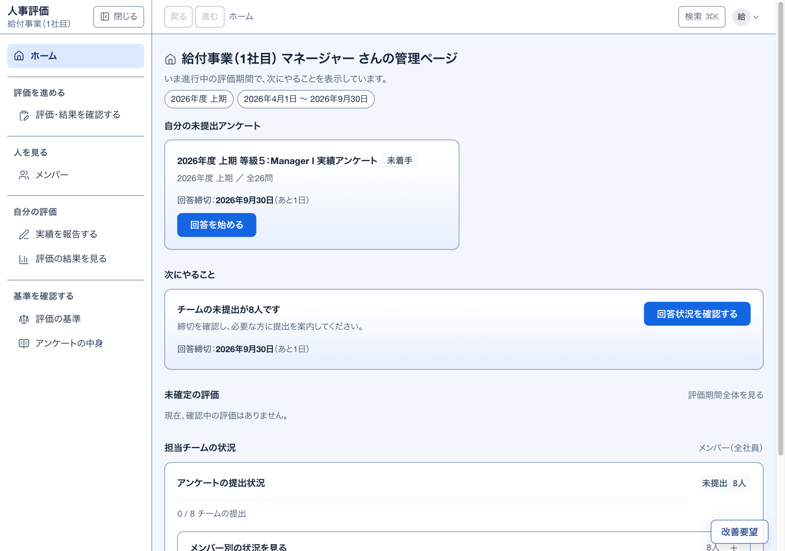 | 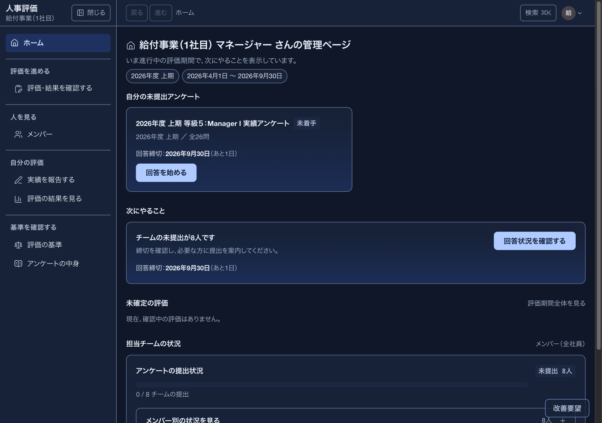 |

## グレー

2026-09-29 まで既定だった無彩色の系統です。

| 明るい | 暗い |
|---|---|
| 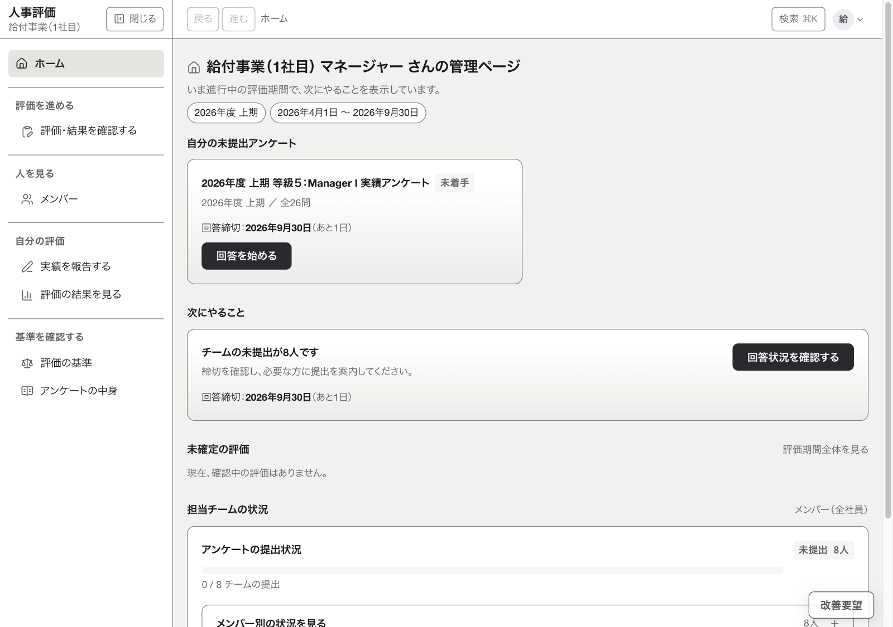 | 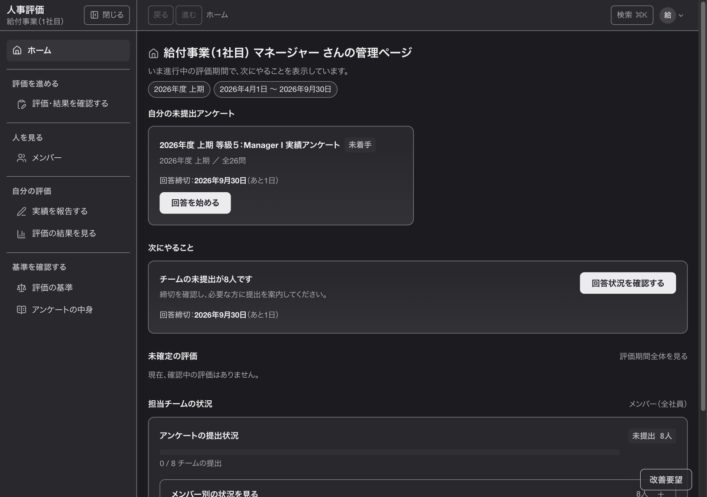 |

## ブルー

| 明るい | 暗い |
|---|---|
| 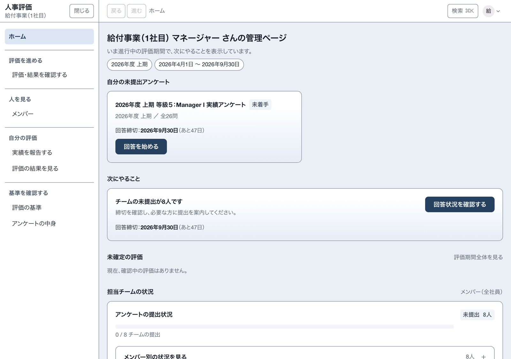 | 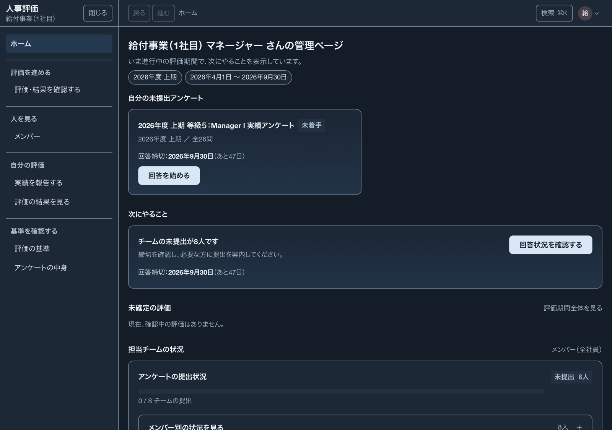 |

## ベージュ

| 明るい | 暗い |
|---|---|
| 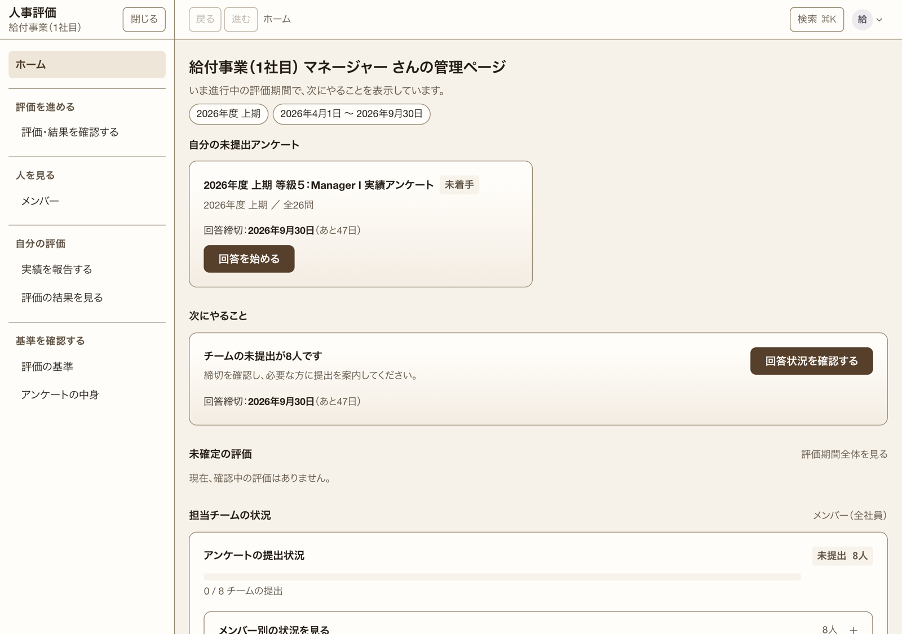 | 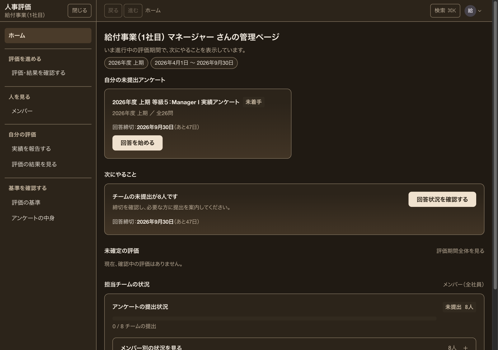 |

## グリーン

| 明るい | 暗い |
|---|---|
| 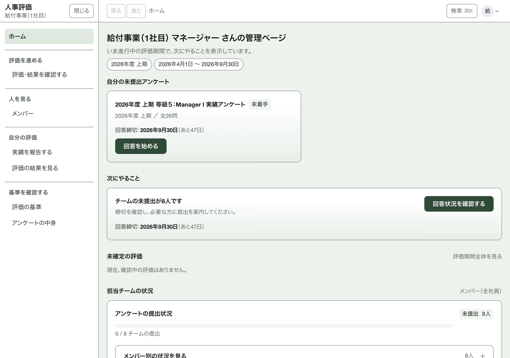 | 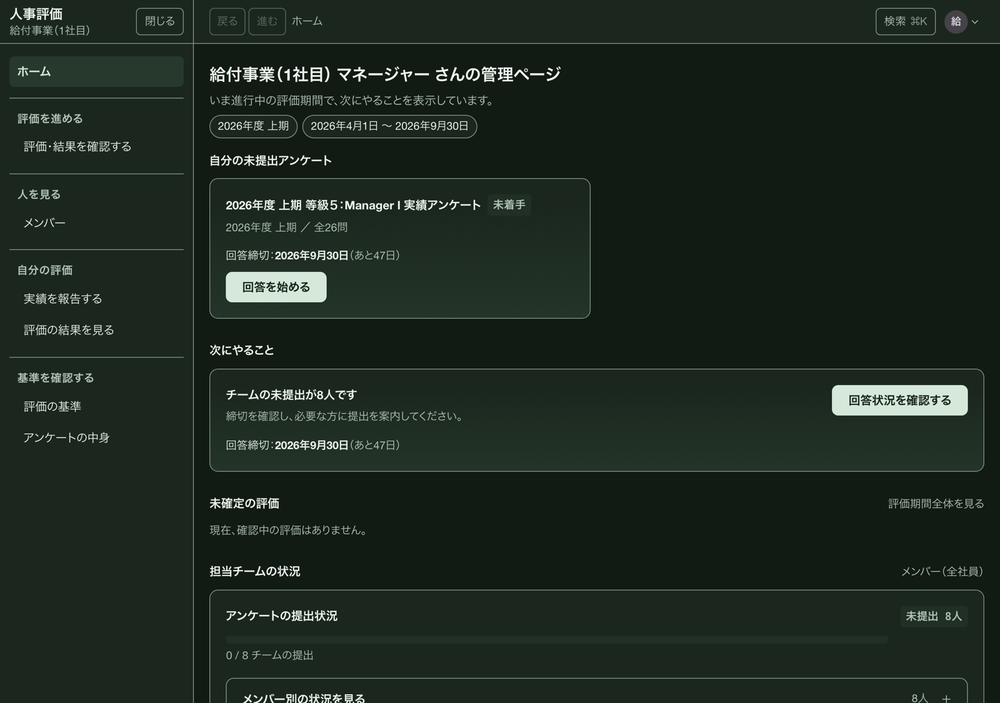 |

## ネイビー

| 明るい | 暗い |
|---|---|
| 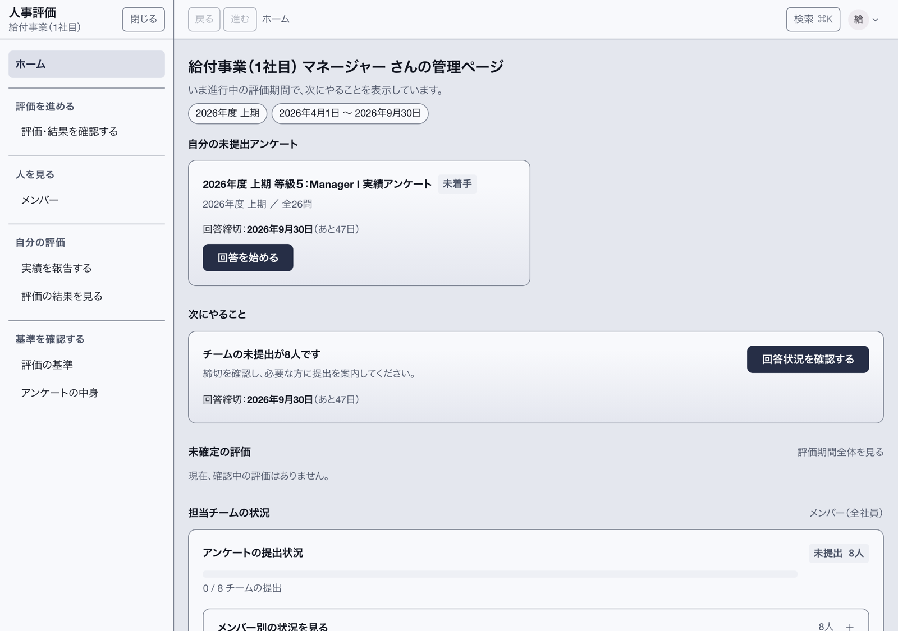 | 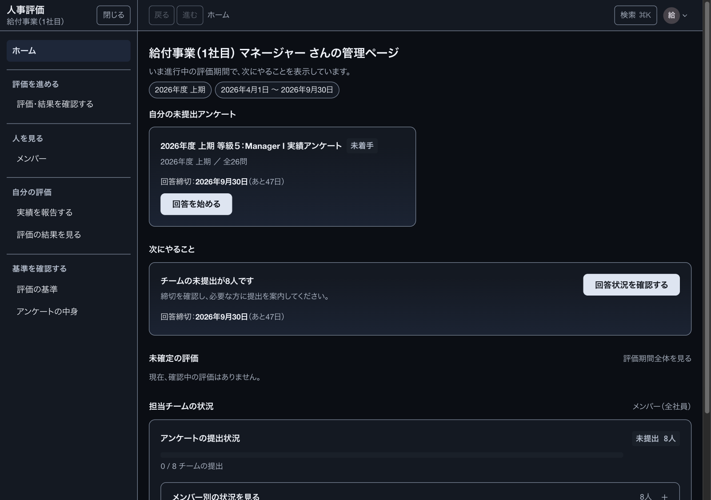 |

## テーマメニュー

右上のアカウントメニューを開くと、明るさと配色が別の設定として並びます。

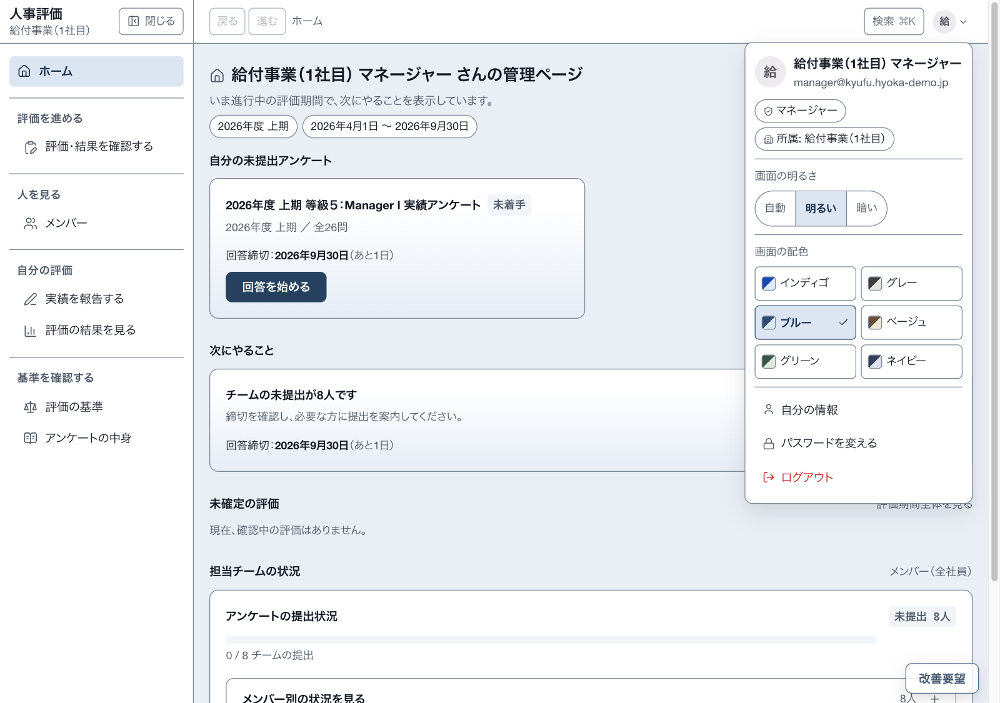

## 画面幅ごとの確認証拠

レスポンシブ確認はブルー・明るいで行います。各画像はDPR 1で、ファイルの横幅とCSS viewportの横幅が一致します。
撮影スクリプトは画像保存前に、横方向のはみ出しがないことと、テーマメニューを開くボタンが表示領域内にあることを検査します。

| CSS viewport | PNG実寸 | 証拠 | 確認点 |
|---:|---:|---|---|
| 375 × 812 | 375 × 812 px | [responsive-375.png](./theme-gallery/responsive-375.png) | モバイル幅。主要内容とテーマメニュー導線が画面内にある |
| 768 × 900 | 768 × 900 px | [responsive-768.png](./theme-gallery/responsive-768.png) | タブレット境界。横方向へはみ出さない |
| 1280 × 900 | 1280 × 900 px | [responsive-1280.png](./theme-gallery/responsive-1280.png) | 標準デスクトップ幅。ギャラリー画像と同じCSS viewport |
| 1600 × 1000 | 1600 × 1000 px | [responsive-1600.png](./theme-gallery/responsive-1600.png) | ワイド幅。本文が不自然に引き伸ばされず、余白構造が保たれる |

## 撮り直し方

1. 撮影専用のローカル環境で `pnpm run db:migrate:local` を実行する。デモ利用者がまだいない場合だけ `pnpm run db:seed:local` も実行する。このseedはローカルD1をデモ内容へ入れ替えるため、残したい手元データがある環境では実行しない。
2. 1つ目のターミナルで `pnpm run preview` を起動し、`http://localhost:8787` が開けるまで待つ。
3. 2つ目のターミナルで `pnpm exec node scripts/capture-theme-gallery.mjs` を実行する。系統を1つ足しただけのときは `--palettes <足した系統>` を付けると、既存の系統の画像を撮り直さずに済む。
4. 標準出力で比較・説明画像（全系統なら13枚）と4枚の幅確認画像について、CSS viewport、DPR、PNG実寸、横方向のはみ出しがないことを確認する。

撮影用利用者を変える場合は `--email` と `--password`、Chromeの場所が標準と違う場合は `--chrome` で指定できます。全オプションは `pnpm exec node scripts/capture-theme-gallery.mjs --help` で確認できます。

## 見比べるときの読みどころ

- 面（背景・カード）の違いだけでなく、主要操作、現在地、見出し、境界線、状態表示の優先順位が明暗の両方で保たれているかを見る。
- 赤（危険）・黄（注意）など、意味を持つ色が配色ごとに別の意味へ見えないかを見る。
- 明るい画面と暗い画面のどちらでも、本文・補足・押せるもの・選択中の状態を区別できるかを見る。
- 375px幅ではデスクトップの縮小版になっていないか、1600px幅では読む行が広がりすぎていないかを見る。

撮影スクリプトは既定の indigo を含む全6系統を撮れます。既定の系統は、保存値を消した状態（`html` に `data-palette` が無い状態）で撮ります。
仕組みと決めごとは [製品仕様の「配色（テーマの系統）」](./spec.md) を参照してください。
